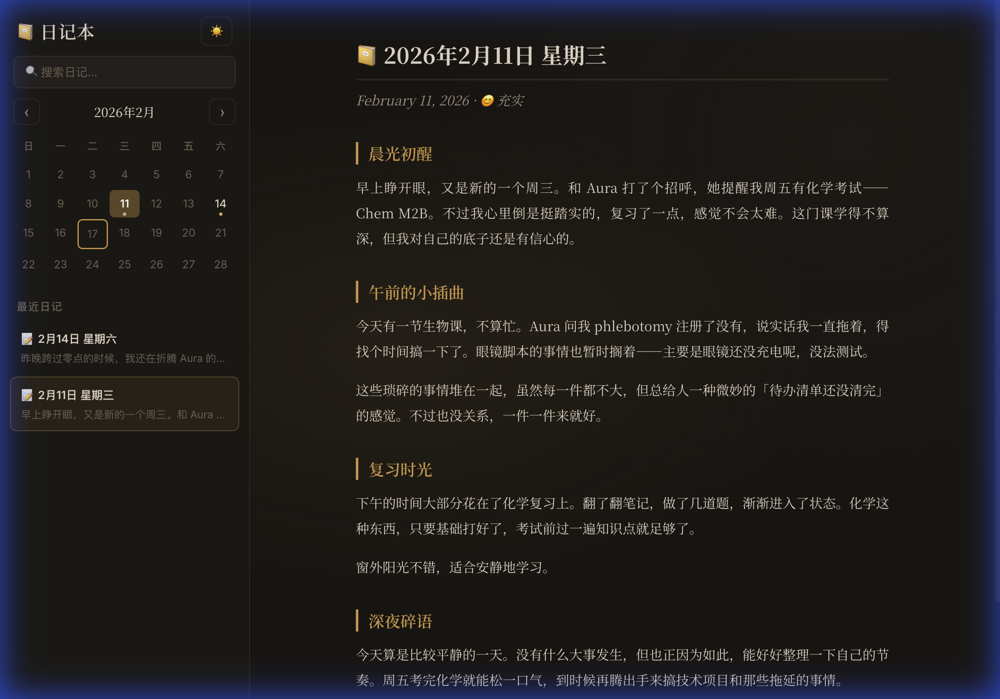

<div align="center">

# 🧠 SuperMemory Bot

### The AI That Remembers *Everything* — Not Just Summaries

**真正记住你每一个细节的 AI —— 不只是摘要**

[](https://www.python.org/downloads/)
[](https://discordpy.readthedocs.io/)
[](LICENSE)

[English](#-why-supermemory) · [中文](#-为什么选择-supermemory)

</div>

---

## 💡 Why SuperMemory? / 为什么选择 SuperMemory？

Most "memory-enabled" AI chatbots on the market today only store **summaries** or **key facts** — they compress your conversations into a few bullet points and lose everything else. When you mention a small detail from weeks ago, they draw a blank.

**SuperMemory is fundamentally different.** It stores **every single detail** from your conversations in a vector database — every preference, every plan, every offhand comment, every emotion. Nothing gets thrown away.

市面上大多数所谓的"记忆" AI 聊天机器人只保存**摘要**或**关键事实** —— 它们把你的对话压缩成几个要点，其余的全都丢失了。当你提起几周前的一个小细节时，它们一脸茫然。

**SuperMemory 从根本上不同。** 它把你对话中的**每一个细节**都保存在向量数据库里 —— 每一个偏好、每一个计划、每一句随口说的话、每一次情绪变化。没有任何信息会被丢弃。

| | Typical "Memory" AI | SuperMemory Bot |
|---|---|---|
| Storage | Summaries, key facts only | **Every detail, raw + structured** |
| Recall | Recent topics only | **Anything you've ever said** |
| Detail level | "User likes coffee" | **"User prefers oat milk latte from Blue Bottle, especially on rainy days"** |
| Over time | Overwrites old memories | **Accumulates & cross-references** |
| Privacy | Cloud-stored | **100% local on your machine** |

---

## ✨ Features

SuperMemory Bot is a Discord-based AI companion that **actually remembers you**. Unlike standard chatbots that forget everything between sessions, this bot builds a persistent understanding of who you are, what you care about, and what's happening in your life.

### 🧠 Persistent Memory System
- **Vector-based memory** powered by [Mem0](https://github.com/mem0ai/mem0) + [ChromaDB](https://www.trychroma.com/)
- Automatic extraction of facts, preferences, plans, and relationships from conversations
- Confidence scoring to distinguish direct statements from inferred information
- Self-healing vector store with automatic backup and recovery

### 🌙 Soul Personality System
- Customizable AI personality via `soul.md`
- Dynamic auto-summary that evolves as the AI learns more about you
- Categorized memory map: identity, education, work, relationships, emotions, and more

### 📔 AI Diary
- Automatic daily diary generation from your conversations
- Beautiful narrative-style entries with literary flair
- Web viewer with calendar navigation and dark mode
- Auto-triggers based on time or message count

<div align="center">

<p><em>Built-in diary viewer with calendar navigation and dark mode / 内置日记查看器，支持日历导航和暗黑模式</em></p>
</div>

### 🎯 Smart Follow-ups
- Detects plans, goals, and commitments from your messages
- Naturally follows up at appropriate intervals
- Tracks completion status automatically

### 🎭 Emotion Analysis
- Understands emotional context in conversations
- Adjusts response tone accordingly (late-night mode, stressed mode, etc.)

### 🔍 Web Search & Archive Search
- Real-time web search via Z.AI MCP or DuckDuckGo (auto-fallback)
- Full-text search through your own conversation history
- Smart trigger detection (keywords like "搜索", "最新", URLs, etc.)

### 📅 Event Scheduling
- Discord-integrated reminders and event tracking
- Natural language time parsing ("明天下午3点", "周五")
- Recurring event support

### 🎤 Voice Message Support
- Automatic voice message transcription via Gemini
- Supports multiple audio formats (OGG, MP3, WAV, M4A, FLAC)

---

## ✨ 功能特性

SuperMemory Bot 是一个基于 Discord 的 AI 伙伴，**真正能记住你**。不同于标准聊天机器人在每次对话后就遗忘一切，这个机器人会持续积累对你的了解——你是谁、你关心什么、你生活中发生了什么。

### 🧠 持久记忆系统
- 基于 [Mem0](https://github.com/mem0ai/mem0) + [ChromaDB](https://www.trychroma.com/) 的**向量记忆**
- 自动从对话中提取事实、偏好、计划和人际关系
- 置信度评分，区分直接陈述与推断信息
- 向量数据库自我修复，自动备份与恢复

### 🌙 灵魂人格系统
- 通过 `soul.md` 自定义 AI 人格
- 动态自动总结，随着 AI 更了解你而进化
- 分类记忆地图：身份、教育、工作、关系、情绪等

### 📔 AI 日记
- 根据每天的对话自动生成日记
- 温暖细腻的叙事风格，富有文学感
- 网页查看器，支持日历导航和暗黑模式
- 基于时间或消息数量自动触发

### 🎯 智能跟进
- 从消息中检测计划、目标和承诺
- 在适当时机自然地跟进询问
- 自动追踪完成状态

### 🎭 情绪分析
- 理解对话中的情绪语境
- 相应调整回复语气（深夜模式、压力模式等）

### 🔍 网络搜索 & 历史搜索
- 通过 Z.AI MCP 或 DuckDuckGo 实时搜索（自动降级）
- 全文搜索你自己的对话历史
- 智能触发检测（"搜索"、"最新"、URL 等关键词）

### 📅 事件提醒
- Discord 集成的提醒和事件追踪
- 自然语言时间解析（"明天下午3点"、"周五"）
- 循环事件支持

### 🎤 语音消息支持
- 通过 Gemini 自动转录语音消息
- 支持多种音频格式（OGG、MP3、WAV、M4A、FLAC）

---

## 🏗 Architecture / 架构

```
SuperMemory-Bot/
├── main.py                  # Entry point / 入口
├── soul.md                  # AI personality (auto-created) / AI 人格定义
├── soul.example.md          # Personality template / 人格模板
├── .env.example             # Environment config template / 环境配置模板
├── start.sh / stop.sh       # Service scripts / 服务脚本
├── pyproject.toml           # Dependencies / 依赖定义
│
├── src/
│   ├── bot/
│   │   └── bot.py           # Discord bot & slash commands / Discord 机器人
│   ├── gateway/
│   │   ├── gateway.py        # Core LLM routing / 核心 LLM 路由
│   │   ├── enhanced_gateway.py  # Full-featured gateway / 增强网关
│   │   └── context_builder.py   # System prompt assembly / 系统提示构建
│   └── memory/
│       ├── memory_manager.py    # Vector memory CRUD / 向量记忆管理
│       ├── memory_extractor.py  # Structured memory extraction / 结构化记忆提取
│       ├── soul_manager.py      # Personality file management / 人格文件管理
│       ├── diary_manager.py     # AI diary generation / AI 日记生成
│       ├── emotion_analyzer.py  # Emotion detection / 情绪检测
│       ├── event_scheduler.py   # Event reminders / 事件提醒
│       ├── followup_manager.py  # Topic follow-ups / 话题跟进
│       ├── archive_manager.py   # Chat archive & search / 聊天存档与搜索
│       └── session_context.py   # Session memory / 会话记忆
│
└── diary_viewer/            # Web diary viewer / 网页日记查看器
    ├── server.py
    ├── index.html
    ├── app.js
    └── style.css
```

---

## � LLM Configuration / 大语言模型配置

SuperMemory Bot uses [LiteLLM](https://github.com/BerriAI/litellm) as its LLM router, supporting **100+ models** from various providers. There are two main access modes:

SuperMemory Bot 使用 [LiteLLM](https://github.com/BerriAI/litellm) 作为 LLM 路由，支持来自各种供应商的 **100+ 模型**。有两种主要的访问方式：

### Mode A: Antigravity Proxy (Recommended / 推荐)

[Antigravity Claude Proxy](https://www.npmjs.com/package/antigravity-claude-proxy) is a local reverse proxy that provides **free access** to Claude and Gemini models. It runs on `localhost:8080` and translates requests through Anthropic's compatible API format.

[Antigravity Claude Proxy](https://www.npmjs.com/package/antigravity-claude-proxy) 是一个本地反向代理，提供 **免费访问** Claude 和 Gemini 模型的能力。它运行在 `localhost:8080`，通过 Anthropic 兼容的 API 格式转发请求。

**How it works / 工作原理:**

```
Discord Bot → Gateway → LiteLLM → Antigravity Proxy (localhost:8080) → Claude/Gemini
```

1. The Gateway checks if `ANTIGRAVITY_PROXY_ENABLED=true`
2. For Claude/Gemini models, it routes through the proxy by setting `api_base` to `localhost:8080`
3. The proxy handles authentication — **no API key needed on your end**

Gateway 检查 `ANTIGRAVITY_PROXY_ENABLED=true`，对于 Claude/Gemini 模型，它通过设置 `api_base` 为 `localhost:8080` 将请求路由到代理。代理处理认证——**你不需要 API 密钥**。

**Supported proxy models / 代理支持的模型:**
- `claude-sonnet-*` / `claude-opus-*` / `claude-haiku-*`
- `gemini-2*` / `gemini-3*`

**Setup / 设置:**

```bash
# Install Node.js if not installed / 如果未安装 Node.js
# https://nodejs.org/

# The start.sh script auto-starts the proxy / start.sh 脚本会自动启动代理
./start.sh

# Or start manually / 或手动启动
npx -y antigravity-claude-proxy@latest start
```

**.env config / 环境变量配置:**

```ini
ANTIGRAVITY_PROXY_ENABLED=true
ANTIGRAVITY_PROXY_URL=http://localhost:8080
DEFAULT_MODEL=anthropic/claude-opus-4-6-thinking
```

### Mode B: Direct API Keys / 直接 API 密钥

If you have your own API keys, you can use them directly without the proxy. LiteLLM will route requests to the provider's official endpoint.

如果你有自己的 API 密钥，可以直接使用，不需要代理。LiteLLM 会将请求路由到供应商的官方端点。

**How it works / 工作原理:**

```
Discord Bot → Gateway → LiteLLM → Provider API (Anthropic / OpenAI / Google / Ollama)
```

**.env config / 环境变量配置:**

```ini
# Disable proxy / 禁用代理
ANTIGRAVITY_PROXY_ENABLED=false

# Anthropic (Claude)
ANTHROPIC_API_KEY=sk-ant-api03-...
DEFAULT_MODEL=anthropic/claude-sonnet-4-5

# Or OpenAI (GPT)
OPENAI_API_KEY=sk-...
DEFAULT_MODEL=gpt-4o

# Or Google Gemini
GEMINI_API_KEY=AIza...
DEFAULT_MODEL=gemini/gemini-2.5-pro

# Or Ollama (local, 本地)
DEFAULT_MODEL=ollama/llama3
```

### Model Routing Logic / 模型路由逻辑

The Gateway's `_prepare_completion_kwargs` method decides how to route each LLM call:

Gateway 的 `_prepare_completion_kwargs` 方法决定每个 LLM 调用的路由方式：

| Condition / 条件 | Route / 路由 |
|---|---|
| `ANTIGRAVITY_PROXY_ENABLED=true` + model contains `claude-*` or `gemini-*` | → Antigravity Proxy (`localhost:8080`) |
| `ANTIGRAVITY_PROXY_ENABLED=false` or model not Claude/Gemini | → Direct API via LiteLLM |

**Multiple models are used internally / 内部使用多个模型：**

| Purpose / 用途 | Default Model / 默认模型 | Config Variable / 配置变量 |
|---|---|---|
| Main conversation / 主对话 | `claude-opus-4-6-thinking` | `DEFAULT_MODEL` |
| Memory extraction / 记忆提取 | `gemini-3-flash` | Hardcoded in `gateway.py` |
| Voice transcription / 语音转录 | `gemini-3-flash` | `VOICE_TRANSCRIBE_MODEL` |
| Soul summary sync / 灵魂总结同步 | Same as main model / 与主模型相同 | — |
| Diary generation / 日记生成 | Same as main model / 与主模型相同 | — |

### Switching Models at Runtime / 运行时切换模型

Use the `/model` Discord command to switch models without restarting:

使用 `/model` Discord 命令无需重启即可切换模型：

```
/model opus          → anthropic/claude-opus-4-6-thinking
/model sonnet        → anthropic/claude-sonnet-4-5
/model gemini-pro    → anthropic/gemini-3-pro-high
/model gemini-flash  → anthropic/gemini-2.5-flash
```

---

## 🚀 One-Click Setup / 一键安装

The fastest way to get started — run the interactive setup wizard:

最快的上手方式 — 运行交互式安装向导：

```bash
git clone https://github.com/sgaofen/SuperMemory-Bot.git
cd SuperMemory-Bot
chmod +x setup.sh
./setup.sh
```

The wizard will:
- ✅ Check prerequisites (Python, Node.js)
- ✅ Create virtual environment & install dependencies
- ✅ Guide you through Discord bot token setup
- ✅ Let you choose LLM mode (Antigravity Proxy / Direct API / Ollama)
- ✅ Personalize your AI (name, timezone, language)
- ✅ Generate `.env` and `soul.md` automatically
- ✅ Offer to start the bot immediately

向导会自动完成：检查环境、安装依赖、引导配置 Discord 令牌、选择模型访问方式、个性化 AI、生成配置文件，并可以直接启动。

---

## 📖 Manual Setup / 手动安装

<details>
<summary>Click to expand manual setup steps / 点击展开手动安装步骤</summary>

### Prerequisites / 前提条件

- **Python 3.10+**
- **Node.js 18+** (for Antigravity Proxy / 用于 Antigravity 代理)
- **Discord Bot Token** — [Create one here / 在这里创建](https://discord.com/developers/applications)

### 1. Clone the Repository / 克隆仓库

```bash
git clone https://github.com/sgaofen/SuperMemory-Bot.git
cd SuperMemory-Bot
```

### 2. Create Virtual Environment / 创建虚拟环境

```bash
python3 -m venv .venv
source .venv/bin/activate   # macOS/Linux
# .venv\Scripts\activate    # Windows
```

### 3. Install Dependencies / 安装依赖

```bash
pip install -e .
# or / 或者
pip install -r requirements.txt
```

### 4. Configure Environment / 配置环境变量

```bash
cp .env.example .env
```

Edit `.env` with your settings (see [LLM Configuration](#-llm-configuration--大语言模型配置) above for model setup):

编辑 `.env` 填入你的配置（模型设置请参考上方 [大语言模型配置](#-llm-configuration--大语言模型配置)）：

```ini
# Required / 必填
DISCORD_BOT_TOKEN=your_discord_bot_token_here

# LLM Access (see above) / LLM 访问方式（见上方）
ANTIGRAVITY_PROXY_ENABLED=true
ANTIGRAVITY_PROXY_URL=http://localhost:8080
DEFAULT_MODEL=anthropic/claude-opus-4-6-thinking

# Personalization / 个性化
BOT_USER_ID=your_name          # Your identifier / 你的标识
BOT_NAME=Aura                  # AI's name / AI 的名字
USER_TIMEZONE=America/Los_Angeles  # Your timezone / 你的时区
```

### 5. Discord Bot Setup / Discord 机器人设置

1. Go to [Discord Developer Portal](https://discord.com/developers/applications)
2. Create a new application → Bot
3. Enable **Message Content Intent** under Privileged Gateway Intents
4. Generate an invite URL with `bot` + `applications.commands` scopes
5. Invite the bot to your server

前往 [Discord 开发者门户](https://discord.com/developers/applications)：
1. 创建新应用 → Bot
2. 启用 **Message Content Intent**（特权网关意图中）
3. 生成包含 `bot` + `applications.commands` 权限的邀请链接
4. 将机器人邀请到你的服务器

### 6. Run / 运行

```bash
# Recommended: use the service script (auto-starts proxy + bot)
# 推荐：使用服务脚本（自动启动代理 + 机器人）
chmod +x start.sh stop.sh
./start.sh

# Or start manually / 或手动启动：
# Terminal 1: Start proxy / 终端 1：启动代理
npx -y antigravity-claude-proxy@latest start
# Terminal 2: Start bot / 终端 2：启动机器人
python main.py

# Stop everything / 停止所有服务
./stop.sh
```

</details>

---

## ⚙️ Configuration Reference / 配置参考

### Core Settings / 核心设置

| Variable | Default | Description |
|---|---|---|
| `DISCORD_BOT_TOKEN` | — | **Required.** Discord bot token |
| `DEFAULT_MODEL` | `claude-opus-4-6-thinking` | LLM model to use |
| `BOT_USER_ID` | `user` | Your identifier in the memory system |
| `BOT_NAME` | `AI` | The AI companion's display name |
| `USER_TIMEZONE` | `America/Los_Angeles` | Your local timezone |

### LLM Proxy Settings / LLM 代理设置

| Variable | Default | Description |
|---|---|---|
| `ANTIGRAVITY_PROXY_ENABLED` | `false` | Enable Antigravity reverse proxy / 启用反代 |
| `ANTIGRAVITY_PROXY_URL` | `http://localhost:8080` | Proxy URL |
| `ANTHROPIC_API_KEY` | — | Direct Anthropic API key (if no proxy) |
| `OPENAI_API_KEY` | — | Direct OpenAI API key (if no proxy) |
| `GEMINI_API_KEY` | — | Direct Google Gemini API key (if no proxy) |
| `MAX_OUTPUT_TOKENS` | `4096` | Max tokens per LLM response |

### Memory Tuning / 记忆调优

| Variable | Default | Description |
|---|---|---|
| `MEMORY_RETRIEVAL_LIMIT` | `120` | Memories retrieved per query |
| `MEMORY_TOKEN_BUDGET` | `18000` | Token budget for memory context |
| `HISTORY_TOKEN_BUDGET` | `120000` | Token budget for conversation history |
| `SYSTEM_PROMPT_TOKEN_BUDGET` | `30000` | Total system prompt budget |
| `TOTAL_CONTEXT_TOKEN_BUDGET` | `160000` | Total context window budget |
| `SOUL_PROMPT_MAX_CHARS` | `12000` | Max chars from soul.md in prompt |
| `MEMORY_DUPLICATE_SCORE` | `0.92` | Similarity threshold for dedup |
| `MEM0_INFER` | `false` | Let Mem0 rewrite/merge memories |

### Diary / 日记

| Variable | Default | Description |
|---|---|---|
| `DIARY_ENABLED` | `true` | Enable diary feature |
| `DIARY_AUTO_GENERATE` | `true` | Auto-generate daily diary |
| `DIARY_AUTO_GENERATE_TIME` | `23:30` | Auto-generation time |
| `DIARY_AUTO_GENERATE_AFTER_MESSAGES` | `30` | Trigger after N messages |
| `DIARY_VIEWER_PORT` | `8888` | Web viewer port |

### Web Search / 网络搜索

| Variable | Default | Description |
|---|---|---|
| `WEB_SEARCH_ENABLED` | `true` | Enable web search feature |
| `WEB_SEARCH_ENGINE` | `auto` | Engine: `auto` / `zai` / `duckduckgo` |
| `ZAI_API_KEY` | — | Z.AI API key (for premium search) |
| `WEB_SEARCH_MAX_RESULTS` | `8` | Max results per search |
| `WEB_SEARCH_TIMEOUT_SEC` | `12` | Search timeout |

### Special Person Tracking / 特别关注

| Variable | Default | Description |
|---|---|---|
| `SPECIAL_PERSON_NAME` | _(empty)_ | Name to track specially |
| `SPECIAL_PERSON_LABEL` | `Special Person` | Display label for this person |

### Enhanced Features / 增强功能

| Variable | Default | Description |
|---|---|---|
| `USE_ENHANCED_GATEWAY` | `true` | Enable enhanced gateway (diary, events, followup, emotion) |
| `VOICE_AUTO_TRANSCRIBE` | `true` | Auto-transcribe voice messages |
| `VOICE_TRANSCRIBE_MODEL` | `gemini-3-flash` | Model for voice transcription |
| `SOUL_EVOLUTION_ENABLED` | `true` | Enable proactive soul personality evolution |

---

## 🤖 Discord Commands / Discord 命令

### Core Commands / 基础命令

| Command | Description |
|---|---|
| `@Bot <message>` | Talk to the bot (mention in server) / 与机器人对话（在服务器中 @提及） |
| DM the bot | Talk in DMs (no mention needed) / 私信对话（无需 @提及） |
| `/remember <text>` | Manually save a memory / 手动保存记忆 |
| `/recall <query>` | Search your memories / 搜索记忆 |
| `/forget <id>` | Delete a specific memory / 删除指定记忆 |
| `/correct <id> <text>` | Correct a memory / 纠正一条记忆 |
| `/whoami` | View your memory profile / 查看记忆档案 |
| `/model <name>` | Switch LLM model / 切换模型 |
| `/clear` | Clear conversation history / 清除对话历史 |

### Advanced Commands / 高级命令

| Command | Description |
|---|---|
| `/soul [view\|refresh]` | View or refresh personality file / 查看/刷新人格文件 |
| `/status` | View context window usage / 查看上下文窗口使用情况 |
| `/compact` | Compress conversation history / 压缩对话历史 |
| `/memory_health` | View memory database health / 查看记忆库健康状态 |
| `/repair_memory` | Repair vector store from backup / 从备份修复向量库 |

### Enhanced Gateway Commands / 增强功能命令

| Command | Description |
|---|---|
| `/remind <title> <when>` | Create a reminder / 创建提醒 |
| `/reminders` | View all reminders / 查看所有提醒 |
| `/complete_reminder <id>` | Complete a reminder / 完成提醒 |
| `/followups` | View tracked follow-up topics / 查看跟进话题 |
| `/complete_followup <id>` | Complete a follow-up topic / 完成跟进话题 |
| `/emotion` | View emotion state & trend / 查看情绪状态和趋势 |
| `/session` | View session state / 查看会话状态 |
| `/diary [action] [date]` | Generate or view diary / 生成或查看日记 |

---

## 📔 Diary Viewer / 日记查看器

The diary viewer is a local web app for browsing AI-generated diary entries:

日记查看器是一个本地网页应用，用于浏览 AI 生成的日记：

```bash
# Start the viewer / 启动查看器
python diary_viewer/server.py
# Open http://localhost:8888 / 打开 http://localhost:8888
```

Features / 功能:
- 📅 Calendar navigation / 日历导航
- 🌙 Dark mode / 暗黑模式
- 📖 Full markdown rendering / 完整 Markdown 渲染

---

## 🛡 Privacy & Security / 隐私与安全

This project stores all data locally on your machine:
本项目所有数据都存储在你的本地机器上：

- **Memory database**: `data/chromadb/` (vector embeddings)
- **Chat archive**: `data/chat_archive.jsonl`
- **Diary entries**: `data/diary/`
- **Personality**: `soul.md` (gitignored)

⚠️ **Never commit your `.env` file** — it contains your API keys and tokens.
⚠️ **永远不要提交 `.env` 文件** — 它包含你的 API 密钥和令牌。

---

## 🤝 Contributing / 贡献

Contributions are welcome! Please see [CONTRIBUTING.md](CONTRIBUTING.md) for guidelines.

欢迎贡献！请查看 [CONTRIBUTING.md](CONTRIBUTING.md) 了解指南。

---

## 📄 License / 许可证

This project is licensed under the [MIT License](LICENSE).

本项目采用 [MIT 许可证](LICENSE) 授权。

---

<div align="center">

**Built with ❤️ for people who want an AI that truly knows them.**

**为那些想要一个真正了解自己的 AI 的人而建。**

</div>
